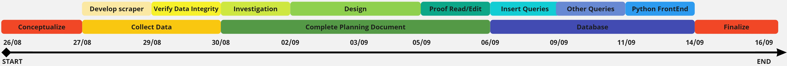

<h3 style='font-size:3em; line-height:0px;'> Rock Scalers </h3>
<h3 style='font-size:1.37em; line-height:0.5em'> For all your climbing needs </h3>

An SQLite Database assignment 

By Lincoln MURRAY (Student)

# Part 1
## Outline
The purpose of this software/Database is to provide a backend for a rock climbing store that sells products for a mark up from other stores. In order to provide a low work profit. This backend will be based in SQLite and will hold a list of products, their respective suppliers, manufacturers and customer they’ve been sold too. There are many steps required to complete this task, To start off it is required to conceptualize the plan/idea for the task, As previously mentioned this task is a rock climbing store. Secondly it is required to confirm that the data is able to be collected, so a piece of python code to scrape the data from various websites was created and the data integrity was verified. After that the plan needs to be set in stone by creating this planning document. The investigation part first then the design then final edits. Finally the Database needs to be developed, insert queries for the data first then the rest of the queries for the front end and lastly compiling it all together in a flask based python back end. Then the entire project can be finalized, this includes final edits in the document, front end, and any other final touches. You can see this visually laid out in the timeline below:
## Timeline
  

## Description
### Requirements
- A SQLite Database  
    -	The storage of relevant data of customers. 
        - Orders  
        - Personal Data  
            - Address  
                - Billing 
                - Delivery  
            - Card details  
            - Name  
    - The storage of relevant data of products  
        - Manufacturers  
            - Established date  
            - Established locations  
        - Suppliers  
            - URL  
        - Products  
            - Price from different suppliers  
            - Purchase URL  
            - Description  
- A Flask based python frontend.  
    - The ability for a customer to order products.  
    - Visually appealing  
    - Display products  
        - Automatically find cheapest price from suppliers  

### Ethical, Legal and Security issues
  The Australian privacy principles

Australian Privacy Principle 1—open and transparent management of personal information:

The customers will be alerted how it will only be used within the store.

Australian Privacy Principle 2—anonymity and pseudonymity:

 This principle will be covered by providing the ability for a guest account to be used if required.

Australian Privacy Principle 3—collection of solicited personal information:

Only required information will be stored such as card information, delivery and billing information and their name.

Australian Privacy Principle 4—dealing with unsolicited personal information:

 All data will be collected with consent from the customers.

Australian Privacy Principle 5—notification of the collection of personal information:

 The users will be alerted about what data is stored by the website.

Australian Privacy Principle 6—use or disclosure of personal information:

The customer will be alerted to the use of personal information within the site and how it will be only used within this product.

Australian Privacy Principle 7—direct marketing:

The customer may consent to direct marketing requiring the use of their name and a contact method, this service will be operated privately.

Australian Privacy Principle 8—cross‑border disclosure of personal information:

 All Data will be stored within an Australian server and will not cross the border to a foreign entity.

Australian Privacy Principle 9—adoption, use or disclosure of government related identifiers:

 No government identifiers will be used to identify any information.

Australian Privacy Principle 10—quality of personal information:

The quality of the personal information collected is up to the customer, as they’re inputting it directly, this means that any personal information is first hand and should be of high quality with great accuracy.

Australian Privacy Principle 11—security of personal information:

The personal information will be secure as it will be stored locally on a secure server with a high quality firewall, and any data transmitted will be encrypted

Australian Privacy Principle 12—access to personal information:

 Users of the store may send a request for all records their personal data to be sent to them.

Australian Privacy Principle 13—correction of personal information:

 Users of the store may also request for incorrect data to be corrected as soon as possible.  

In addition to the Australian privacy principles Users may also request to have the record of their personal information deleted, excluding records of a sale. This means that once the payment has been processed their customer details will be deleted.  
### Quality of Data
There are limited factors impacting the quality of data as it is all collected first hand. This is due to the nature of the database, some impacting factors include the data from the stores data is scraped from, Some of these such as spelling mistakes are not that critical and will not impact the store. Other factors such as faulty prices are critical but if the store the data is scraped from is wrong then it should not impact the profit margin of the store. Under the assumption that they honor their mistake.  
## Design
### Entity Relationship Diagram
  

### Relational Notation
<pre>
Products(<u>ProductID</u>, ManufacturerID (FK), Description)

Manufacturers(<u>ManufacturerID</u>, Location, DateFounded)

Product-Supplier(<u>ProductID</u> (FK), <u>SupplierID</u> (FK), ProductURL, Price)

Suppliers(<u>SupplierID</u>, SupplierURL)

Product-Order(<u>ProductID</u> (FK), <u>OrderID</u> (FK))

Orders(<u>OrderID</u>, <u>CustomerID</u> (FK), DeliveryAddress, BillingAddress, DeliveryRequest, Total)

Customers(<u>CustomerID</u>, Name)

</pre>

### Data Dictionary
<table><thead>
  <tr>
    <th>Element Name</th>
    <th>Data Type</th>
    <th>Description</th>
    <th>Constraints</th>
  </tr></thead>
<tbody>
  <tr>
    <td>ProductID</td>
    <td>Integer</td>
    <td>A Unique identify for each product.</td>
    <td>Must be unique, &gt;= 0 and not null</td>
  </tr>
  <tr>
    <td>ManufacturerID</td>
    <td>Integer</td>
    <td>A Unique identify for each manufacturer.</td>
    <td>Must be unique, &gt;= 0 and not null</td>
  </tr>
  <tr>
    <td>Description</td>
    <td>String</td>
    <td>The descriptor for each product.</td>
    <td>No constraints</td>
  </tr>
  <tr>
    <td>Location</td>
    <td>String</td>
    <td>General location of the manufactuer companies origin.</td>
    <td>Max Length 50 Characters</td>
  </tr>
  <tr>
    <td>DateFounded</td>
    <td>Integer</td>
    <td>Year the company was founded</td>
    <td>Must be &gt; 0, &lt;= Current Year and not null</td>
  </tr>
  <tr>
    <td>SupplierID</td>
    <td>Integer</td>
    <td>A Unique identify for each supplier.</td>
    <td>Must be unique, &gt;= 0 and not null</td>
  </tr>
  <tr>
    <td>ProductURL</td>
    <td>String</td>
    <td>The URL to order the product.</td>
    <td>Max Length 100 Characters and not null</td>
  </tr>
  <tr>
    <td>Price</td>
    <td>Float</td>
    <td>The price of the product</td>
    <td>Must be &gt; 0 and not null</td>
  </tr>
  <tr>
    <td>SupplierURL</td>
    <td>String</td>
    <td>The URL to view the suppliers website</td>
    <td>Max Length 100 Characters and not null</td>
  </tr>
  <tr>
    <td>OrderID</td>
    <td>Integer</td>
    <td>A Unique identify for each order.</td>
    <td>Must be unique, &gt;= 0 and not null</td>
  </tr>
  <tr>
    <td>CustomerID</td>
    <td>Integer</td>
    <td>A Unique identify for each customer.</td>
    <td>Must be unique, &gt;= 0 and not null</td>
  </tr>
  <tr>
    <td>DeliveryAddress</td>
    <td>String</td>
    <td>The Address for the order to be delivered to.</td>
    <td>Max Length 200 Characters and not null</td>
  </tr>
  <tr>
    <td>BillingAddress</td>
    <td>String</td>
    <td>The Billing address required by law to invoice the purchase to.</td>
    <td>Max Length 200 Characters</td>
  </tr>
  <tr>
    <td>DeliveryRequest</td>
    <td>String</td>
    <td>Any special requests for the delivery such as ATL.</td>
    <td>Max length 500 Characters</td>
  </tr>
  <tr>
    <td>Total</td>
    <td>Float</td>
    <td>The price of the order.</td>
    <td>Must be &gt;= 0 and not null</td>
  </tr>
  <tr>
    <td>Name</td>
    <td>String</td>
    <td>The Customer name used for shipping and addressing them.</td>
    <td>Max Length 50 Characters</td>
  </tr>
</tbody></table>

### Outline of Queries
Queries required for this project include but are not limited to:  
-	Create Orders  
-	Create Customers  
-	Select Products  
-	Select Product in an order  
-	Add/Remove Items from an order  
-	Insert all products  
# Part 2
## Evaluation  
### Reflect
My software solution to part 1 meets the criteria I outlined in part one reasonably well, storing all the required data in the backend. Although it lacks the display of this data in the frontend solution. The Flask based python frontend allows for customers to add or remove products to or from an order, is reasonably visually appealing through its minimalist layout and displays all the products stored within the SQLite Database. Where it does lack is in finding the cheapest price from suppliers as currently the Database only has one suppliers per product, although this would be done through the use of an aggregate function such as MIN().
The Structure of the finished Database is quite different to the initial ER Diagram outlined. Such as storing the Delivery address instead of the Delivery ID in the orders table and the billing address in the Customers table. This is one of the extra features implemented for individuals that don't want the same billing and delivery address.  
### Bugs/Limitations  
Check the issues tab on GitHub
### Retrospective  
In order to optimise the process for next time there are a few things I would do differently, to start off I would also plan out the software component of the project, in order to create a smoother cleaner set of code and UI, another change I would make is to sketch out the UI clearly in order to avoid making critical decisions while developing. While Things that work well include creating the ER Diagram before developing the Database and using python3 as well as BS4 to scrape the data.

# References

ADDITIONAL SYLLABUS SUPPORT BOOKLET. (2024, February 6). 

https://senior-secondary.scsa.wa.edu.au/__data/assets/pdf_file/0003/1090875/Year-11_12_Computer-Science_ATAR_Additional-syllabus-support-booklet.PDF

Black Diamond Equipment Australia | Climbing Equipment & Outdoor Gear. (2024). Black Diamond Australia. 

https://www.blackdiamondequipment.com.au/

COMPUTER SCIENCE ATAR COURSE Year 12 syllabus. (2024). 

https://senior-secondary.scsa.wa.edu.au/__data/assets/pdf_file/0008/1017782/Computer-Science-Y12-Syllabus-ATAR-20192.PDF

HTML Tables generator – TablesGenerator.com. (n.d.). 

Www.tablesgenerator.com

https://www.tablesgenerator.com/html_tables#

ilovepdf.com. (2019). iLovePDF | Online PDF tools for PDF lovers. ILovePDF - Online Tools for PDF. 

https://www.ilovepdf.com/

La Sportiva Spa. (2024). La Sportiva Spa. 

https://www.lasportiva.com/au

md2pdf - Markdown to PDF. (2024). Netlify.app. 

https://md2pdf.netlify.app/

MyBib. (2018, July 13). MyBib bibliography generator. MyBib.com. 

https://www.mybib.com

SQL Online Compiler - for Data Science. (n.d.). Sqliteonline.com. 

https://sqliteonline.com/

